# Star HQ
Une companion webApp pour le jeu Star Citizen, afin de facilité la gestion de ses vaisseaux en jeu.

Par Fabien ARTHUR et Matthieu DENIEUL LE DIRAISON
~
## Intro
__Objectif principal :__
* Pouvoir se connecter et ajouter/modifier les vaisseau de son hangar personnel.

__Objectif secondaires :__
* Voir les vaisseaux d'autres personnes / de notre organisation (lien compte du jeu / compte de l'app)
* Fonctions de tri des vaisseaux
* Comparateur de vaisseaux

__Objectif supplémentaires / idées futurs :__
* Feed d'actualités du jeu, dernières maj
* Demande de prêt / d'équipage entre joueurs (envoie de mail ?)
* WebApp -> +Mobile App (voir la faisabilité)
* Personnalisation du vaisseau (composants, quantum drive)
* Calculateur de temps de trajets
* Calculateur de profits commerciaux

__Hors scope :__
* Interaction avec des données dynamiques (en temps réel) du jeu
* Messagerie / Fonctionnalités avancé de chat
* Vérifications des vaisseaux et de leurs appartenance véritable en jeu
~
## Tech
###
__Symfony :__
MVC ; Model, View, Controllers
* Model : Base de donnée __mysql__, hébergé à part.
* View : __Twig__, html, css, javascript (AJAX) et __bootstrap__
* Controller : __php__
	*  API d'une part, endpoint /api
	* Routes ; gestions des pages, de la redirection et de leurs logique
	* Sécurité : Symfony possède des fonctionnalités d'authentification et de sécurité adaptés.

Possibilités de scripts __python__ ;
* Web scrapping pour des données difficile d'accès comme les joueurs et leurs organisations (sur https://robertsspaceindustries.com/), ou les informations des dernières MAJ
* Fonctionnalités plus lourdes (calculateurs de profits)

Sources ;
* API fan-made pour récupéré des données, notamment sur les vaisseaux https://api.star-citizen.wiki/dashboard

## Infra
###
* Client (pc hôte) -> là où on fait la démo et on se connecte au serveur sur le web.
* Serveur web (VM 1) : Ce repo + server DNS
* Serveur database (VM 2) : Le serveur mysql
* Pare-feu (VM 3) : interface entre WAN/pc hôte et serveur web

## Accessibilité
* Couleurs choisis dépendent d'une palette provenant du jeu lui même, cela afin de rendre reconnaissable le site à tout ses joueurs.
* instauration auto completion pour faciliter la selection de vaisseaux, (plus de problèmes pour les noms compliqués ou trop spécifiques)
* Création de catégories afin de classer les vaissseaux et leurs capacités/rôle 
* NavBar épurée pour éviter la confusion au nouveaux arrivant (à l'instare du site officiel qui est très peu beginner friendly)
~

## Suivi
__Au 23/05/2024__
* Reflexion sur l'idée du projet, ses fonctionnalités nécessaires et leurs faisabilités, + des idées futurs
* Reflexion sur les technologies à utilisé ; nous en sommes arrivé au framework Symfony, qui convient au projet et offre une base solide de fonctionnalités et de documentations.
* Apprentissage et découverte du framework, confirmation du choix qui convient bien à notre projet
~
* Setup de l'environnement de développement, guide du README sur son installation pour pouvoir travailler sur plusieurs postes aisément
	* Symfony permet notamment facilement de reproduire le schéma de la base de donnée sur tout les environnements existants, facilement, grâce au système de migration.
* Premiers contrôleurs de tests
* Idée d'un visuel pour notre application, sur figma  
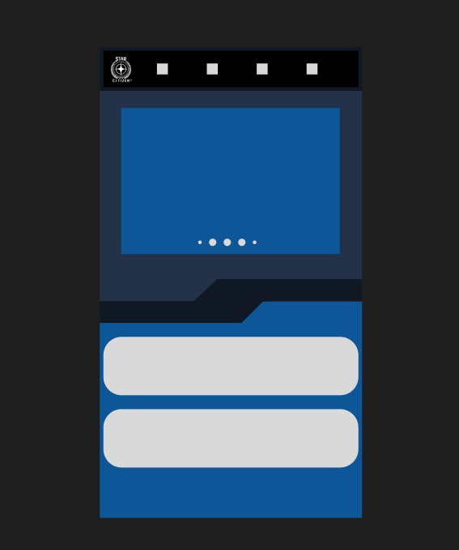
* Début de conception d'un MCD
~
* Début de développement ; fonction de chargement des données de vaisseau depuis l'API externe (https://api.star-citizen.wiki/dashboard) à la db interne  
	* endpoint : /load/ship  
	* src/controller/LoadShipController.php  
	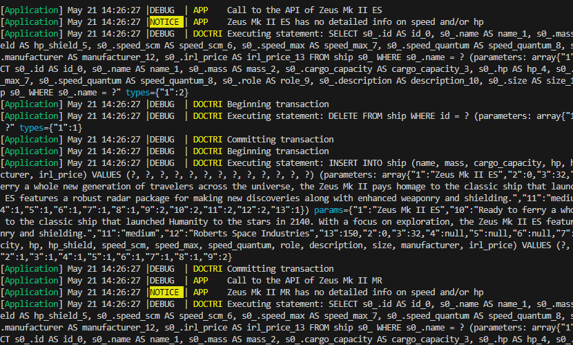
* Barre de recherche, autocompletion avec __jquery__, et redirection grâce au nom des vaisseaux
	*  Dans l'idée de pouvoir selectionner le vaisseau à a jouter à son hangar, depuis la liste de la bdd.
	* search_bar.png  
	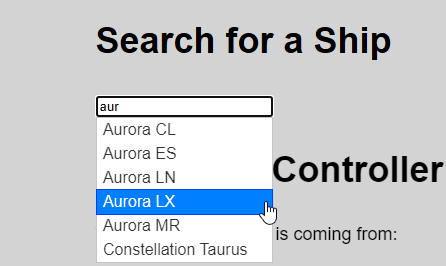

* Prochaine étape : raffiné le MCD et la bd pour intégré les utilisateurs, ayant chacun une liste de vaisseau personnel. Différence entre vaisseaux personnel, unique et appartenant au joueur, et le modèle du vaisseau et ses statistiques, commun à tout les vaisseau de ce type et ayant ce nom.

~  
__24/05/2024__
* Début de MCD
* Ajout de la classe User, des fonctions de Register/Login/Logout 
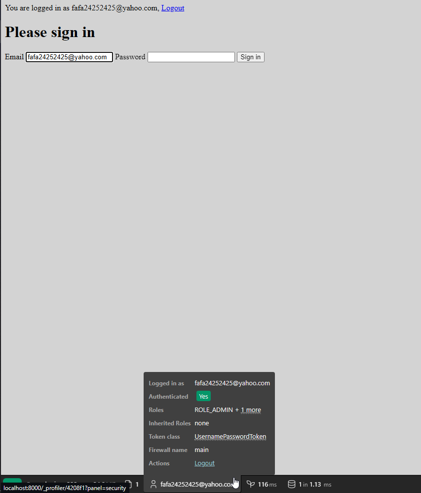
* Essais de restrictions d'accès selon les rôles
* Modification du chargement des vaisseau ; au lieu d'une route, est devenu une commande console, cela fait plus de sens.  
	* Commande app:load-ships (load_ship_command.png)
	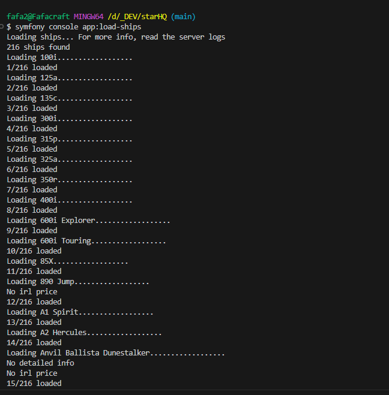
* Reflexion agencement page principale 
* 1ere iteration d'un template convenable
* Conception du template de l'interface utilisateur pour une navigation fluide et intuitive.
* 1er template emplacement des fonctionnalités
	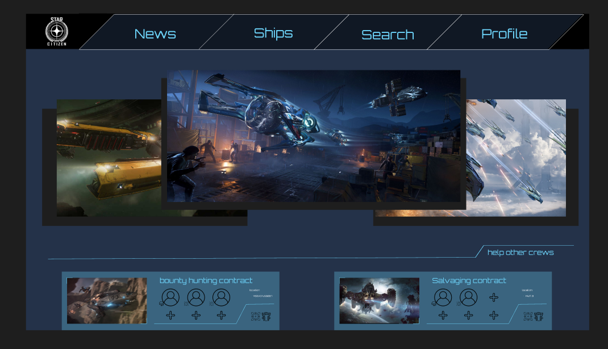
	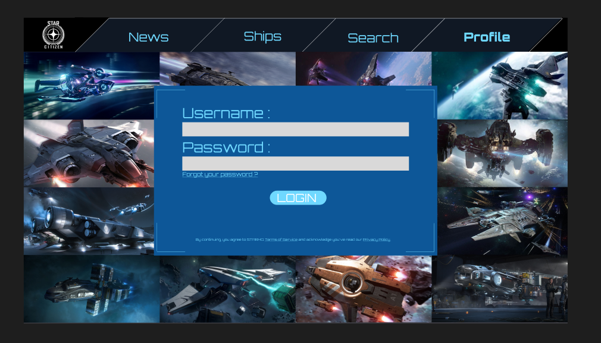  
	
~  
__27/05/2024__
* Création d'une table ShipImage, récupération des images des vaisseaux par webscrapping des pages du magasin officiel
* Créé tech_doc.md avec un résumé de l'organisation technique du projet
* Joint les images à la barre de recherche ; la page d'acceuil affiche l'image de la recherche !
	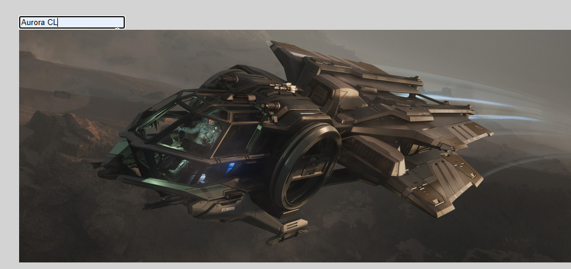 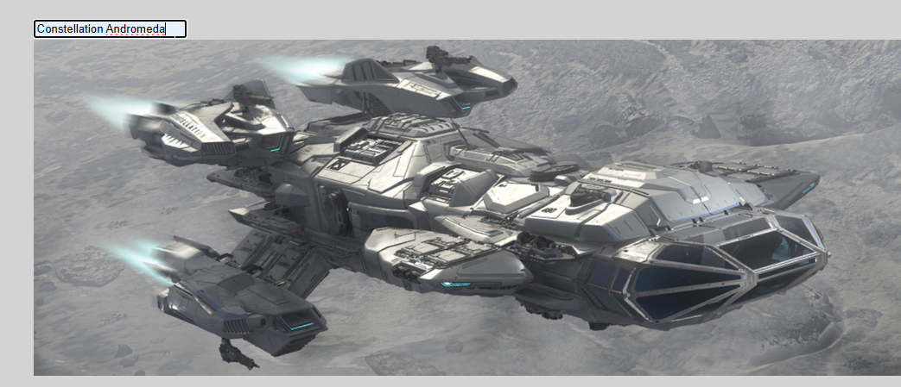

~
__28/05/2024__
* Discussion sur les futurs ajouts et priorités du projets.
* mise en commun des differentes necessité (bouttons, fonctionnement concret)
* Reflexion quand au fonctionnement mobile: compatibilité
* verification des fonctionnalités communes 
* mise en perspective du temps necessaire pour les differents fonctionnalités

~
__29/05/2024__
* Fait les cartes des vaisseau et l'affichage en liste à partir de leur nom.
	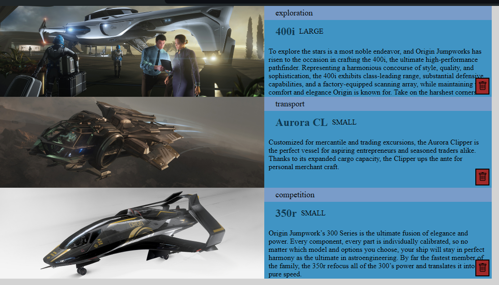
* Discussion et organisation sur l'infrastructure du projet
* Affichage des vaisseaux par rapport à ceux associer à l'utilisateur connecter dans la database
* Creation de la Navbar avec de l'utilisation de bootstrap
* Problemes de merges, reglés
* Creation de la page de connexion automatique

~
__30/05/2024__
* Ajout de la logique du bouton "supprimé" de la liste de vaisseaux et redirection vers sa page
* Déplacer la barre de recherche sur la page principale
* Suppression des classes de tests
* Couleurs différentes selon les rôles.
* Bouton d'ajout des vaisseau à la liste personnel
* Reflexion quant à l'accessibilité du site.
* Documentation sur l'infra, (linux ou windows?)
	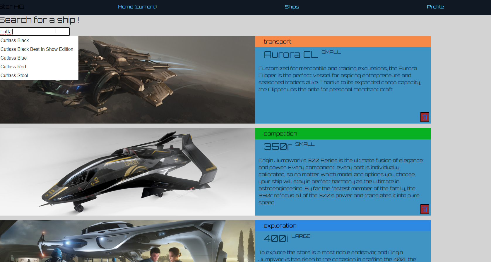 
	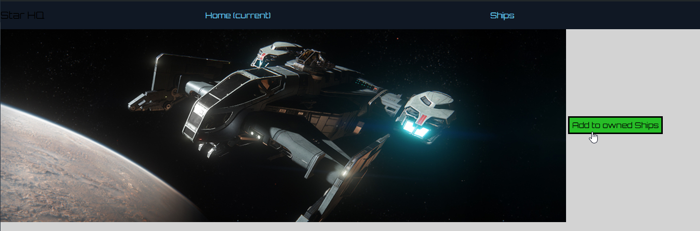 
	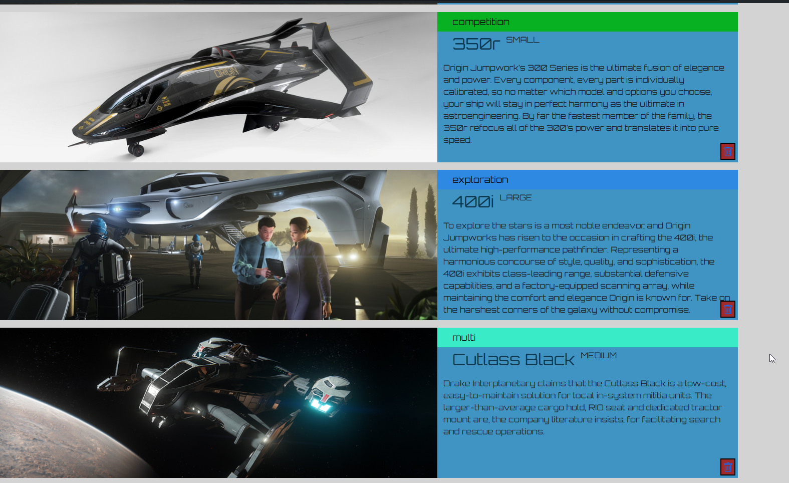

~
__31/05/2024__
* Ajout de l'étoile (favoris -> vaisseaux passent en premier dans la liste)
* Ajout graphiques sur la page d'acceuil
* Ajout d'infos et une page de vaisseau plus jolie
* Ajout d'une image par défaut, lorsqu'il n'y a pas d'image
### Objectif principal complet ;
On peut se connecter, voir les vaisseau que l'on a, et ajouter/supprimer des vaisseau de cette liste. C'est une V1 local !
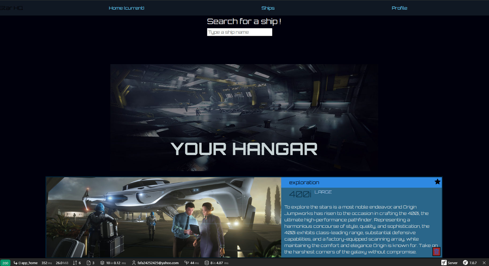
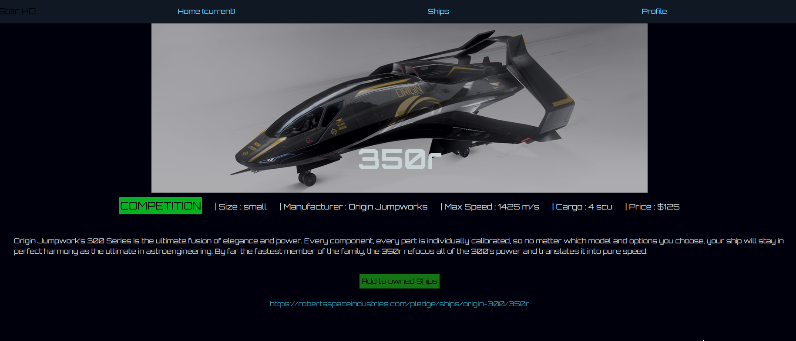
Focus maintenant : l'infra, les VMs.

~
__10/06/2024__
* Montre si l'on a déjà le vaisseau dans son hangar, depuis la page de vaisseau
* Ajout de la page de la liste complète des vaisseau
* Options de tris pour chercher les vaisseau par role, taille et constructeurs
* Ajout de redirections vers la page de login, simplification de navigations...